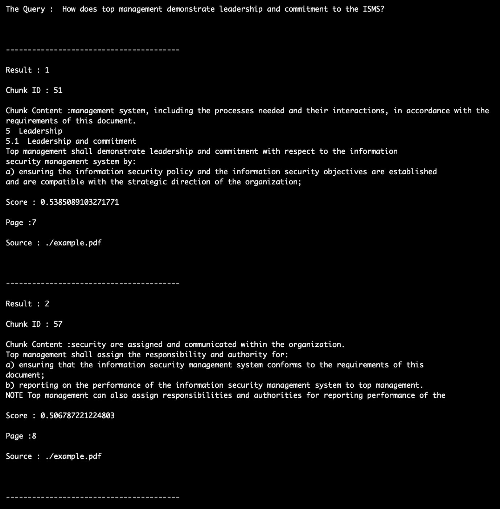
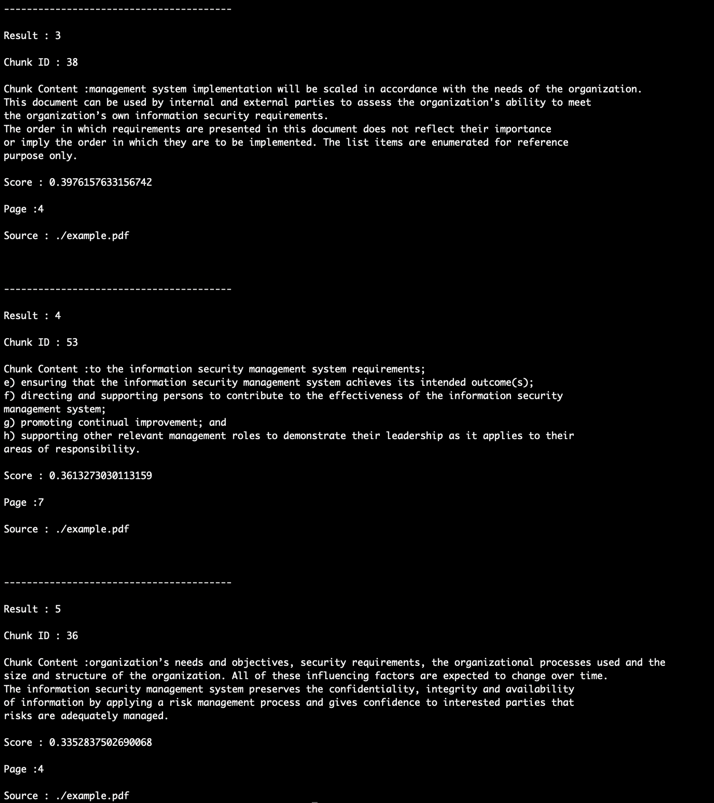
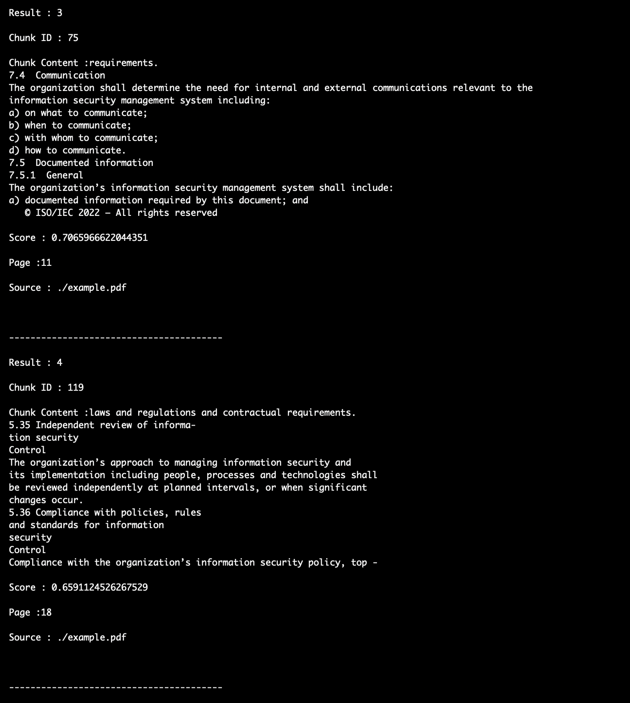
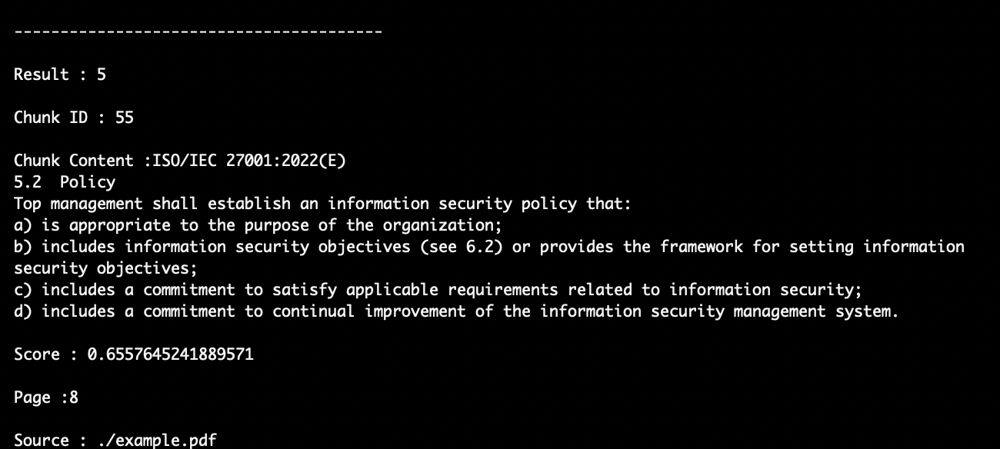
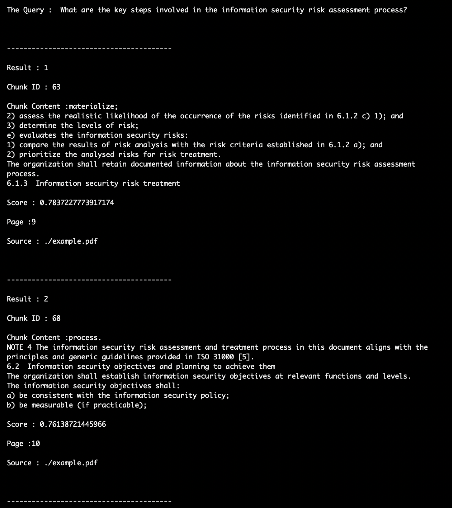
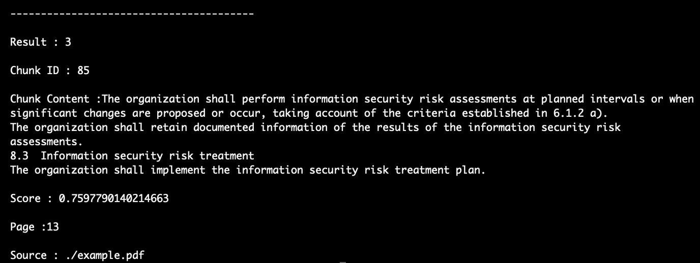

# Documentation for Qdrant Code

**Important:** This Code could run both in 3.11 and 3.14

**Steps to Run the Code**
* pip install -r requirements.txt
* python3 rag_qdrant.py


Libraries Required:

```
from langchain_community.document_loaders import PyPDFLoader
from langchain_text_splitters import RecursiveCharacterTextSplitter
from langchain_huggingface import HuggingFaceEmbeddings
from qdrant_client import QdrantClient
from qdrant_client.http.models import VectorParams,Distance,PointStruct
import re
import pprint
```

### The above were all Required Libraries

* langchain_community.document_loader import PyPDFLoader helps us to pase the pdf document.
* langchain_text_splitters import RecursiveCharacterTextSplitter helps to chunk the parsed data from documents.
* langchain_hugging_face import HuggingFaceEmbeddings helps us to use the embeding model sentence-transformers/all-MiniLM-L6-v2 
* qdrant_client import QdrantClient helps us to create and use the qdrant Vector DB
* qdrant_client.http.models import VectorParams,Distance,PointStruct helps us to configure the qdrant setup the Distance and get Vectorparams and PointStruct a structure of data to insert to Qdrant

### Loading the PDF Docuement 

```
filepath="./example.pdf"

loader=PyPDFLoader(filepath)
print(loader)

docs=loader.load()
```

### Chunking the Docuemnt

```
text_splitter=RecursiveCharacterTextSplitter(chunk_size=500,chunk_overlap=100)

chunks=text_splitter.split_documents(docs)

for idx,chunk in enumerate(chunks):
  chunk.metadata["chunk_id"]=idx

```
From the Above code we use the RecursivecharacterTextSplitter for the chunking of the documents and each chunk has 500 characters as the information was largely in paragraph format and overlap of 100 to preserve the edge information

### Embedding Loading

```
embedings=HuggingFaceEmbeddings(model_name="sentence-transformers/all-MiniLM-L6-v2")

texts=[chunk.page_content for chunk in chunks]
metadata=[chunk.metadata for chunk in chunks]
ids=[str(chunk.metadata["chunk_id"]) for chunk in chunks]
vectors=embedings.embed_documents(texts)

```

Loading the embeding model using the HuggingFace Library **sentence-transformers/all-MiniLM-L6-v2** Used to embed the Chunk which was an Industry Standard

Destructure the Document Chunks into Text,Metadata,Chunk Id and then producing the Vectors using HuggingFace model


### Creating the Qdrant Client and Preparing the Data to Insert

```
client=QdrantClient(path="./vectordb/qdrant")
client.recreate_collection(
  collection_name="ragdata",
  vectors_config=VectorParams(
    size=384,
    distance=Distance.COSINE
  )
)
vectors=embedings.embed_documents(texts)
points=[]
for chunk,vector in zip(chunks,vectors):
  points.append(
    PointStruct(
      id=chunk.metadata["chunk_id"],
      vector=vector,
      payload={
        "text":chunk.page_content,
        **chunk.metadata
      }
    )
  )

```

* The Above Code will create a Qdrant Client that will initiate the Qdrant Database 

* We create the Collection named **ragdata** and configure the collection with vector_config set the size for parameters to **384** and Store using the **COSINE** Function

* Prepare the All the Points to be inserted to the Qdrant using a PointStruct imported from qdrant_client.http.models including the vectors and metadata

### Insert the Data Into the QbridDB

```

client.upsert(
  collection_name="ragdata",
  points=points
)

info=client.get_collection("ragdata")
print(info.points_count)

```
we use the client.upsert to insert the data into the QubridDB and get_collection to have the info and metadata of data.


### Query

```
query="How does top management demonstrate leadership and commitment to the ISMS?"

query_embeding=embedings.embed_query(query)
results=client.query_points(
  collection_name="ragdata",  
  query=query_embeding,
  limit=5
)

for index,i in enumerate(results.points):
  print("\n\n")
  print('-'*40)
  print(f"\nResult : {index+1}")
  print(f"\nChunk ID : {i.id}")
  print(f"\nChunk Content :{i.payload['text']}")

  print(f"\nScore : {i.score}")
  print(f"\nPage :{i.payload['page']}")
  print(f"\nSource : {i.payload['source']}")

client.close()
```

The Query was first embeded with the same Model we embeded the chunks from PDF Document.

Then we search the QubridDB using the query and set the limit to control how many relavent results we see.


# Sample Outputs

### Query: How does top management demonstrate leadership and commitment to the ISMS?
### Top K=5





### Query: What are the requirements for establishing and communicating the information security policy??
### Top K=5






### Query: What are the key steps involved in the information security risk assessment process???
### Top K=3





